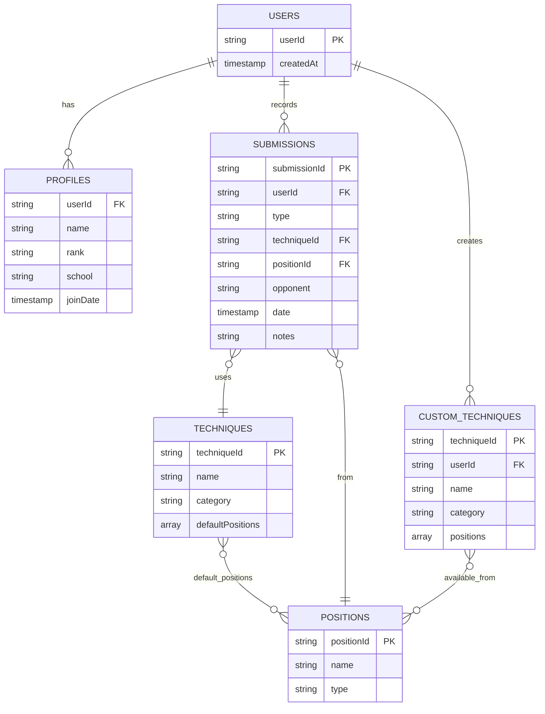

# Jiu-Jitsu Submission Tracker - Backend

The serverless backend for the Jiu-Jitsu Submission Tracker application built with Firebase.

## 🔧 Technology Stack

- **Firebase Cloud Functions**: Serverless backend API endpoints
- **Firestore**: NoSQL database for storing user data and submissions
- **Firebase Authentication**: User authentication and authorization
- **Firebase Storage**: Media and file storage
- **TypeScript**: Type-safe JavaScript for better development experience
- **Swagger/OpenAPI**: API documentation

## 📁 Project Structure

```
subtracker-backend/
├── functions/             # Cloud Functions codebase
│   ├── src/               # Source code
│   │   ├── index.ts       # Main entry point
│   │   ├── auth/          # Authentication functions
│   │   ├── profiles/      # Profile management
│   │   ├── submissions/   # Submission tracking
│   │   ├── techniques/    # Technique management
│   │   └── stats/         # Statistics and analytics
│   ├── lib/               # Compiled JavaScript (generated)
│   ├── package.json       # Dependencies and scripts
│   └── tsconfig.json      # TypeScript configuration
├── public/                # Firebase Hosting files
│   ├── index.html         # Redirect to API docs
│   └── api-docs/          # Swagger UI documentation
│       ├── index.html     # Swagger UI interface
│       └── openapi.json   # API specification
├── firestore.rules        # Firestore security rules
├── storage.rules          # Storage security rules
└── firebase.json          # Firebase configuration
```

## Data Model



### Collections and Documents

- **users/{userId}/**

  - **profile**: User's profile information (name, rank, school)
  - **submissions/{submissionId}**: Records of submissions
  - **custom_techniques/{techniqueId}**: User-created techniques

- **techniques/{techniqueId}**: Standard jiu-jitsu techniques
- **positions/{positionId}**: Positions for executing techniques

## 🚀 Getting Started

### Prerequisites

- Node.js (v16 or higher)
- Firebase CLI (`npm install -g firebase-tools`)

### Installation

1. Clone the repository:

   ```bash
   git clone https://github.com/yourusername/subtracker-backend.git
   cd subtracker-backend
   ```

2. Install dependencies:

   ```bash
   cd functions
   npm install
   ```

3. Set up Firebase:
   ```bash
   firebase login
   firebase use your-project-id
   ```

## ⚙️ Development Workflow

### Local Development with Emulators

1. Start Firebase emulators:

   ```bash
   firebase emulators:start
   ```

2. Access development resources:
   - Emulator UI: http://localhost:4000
   - Functions emulator: http://localhost:5001
   - Hosting (API docs): http://localhost:5002
   - Firestore emulator: http://localhost:8080

### Testing Functions

Use the Emulator UI to test functions:

1. Go to http://localhost:4000
2. Navigate to the "Functions" tab
3. Select a function to test
4. Enter test data and click "Execute"

### Building and Deploying

1. Build the TypeScript code:

   ```bash
   cd functions
   npm run build
   ```

2. Deploy to Firebase:
   ```bash
   firebase deploy               # Deploy everything
   firebase deploy --only functions  # Deploy only functions
   firebase deploy --only hosting    # Deploy only API docs
   ```

## 📝 API Documentation

The API is documented using Swagger/OpenAPI:

- Local: http://localhost:5002/api-docs
- Production: https://subtracker-a2b7d.web.app/api-docs

### Available Endpoints

- `healthCheck`: Basic health check endpoint
- More endpoints coming soon...

## 🔒 Security Model

- All data access is controlled through Firebase Authentication
- Firestore security rules enforce user-level access control
- All API endpoints validate authentication and authorization

## 🔍 Monitoring and Debugging

- View function logs in the Firebase console
- Use the Firebase Emulator UI for local debugging
- Set up Firebase alerts for production monitoring
